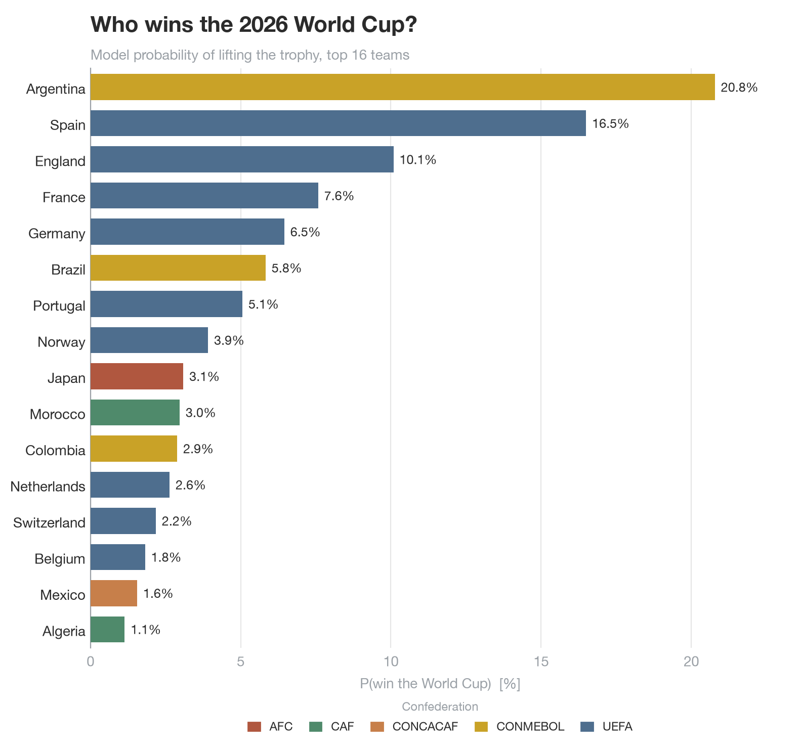
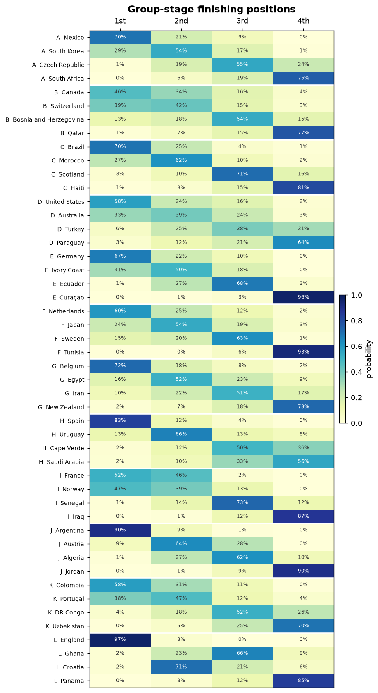
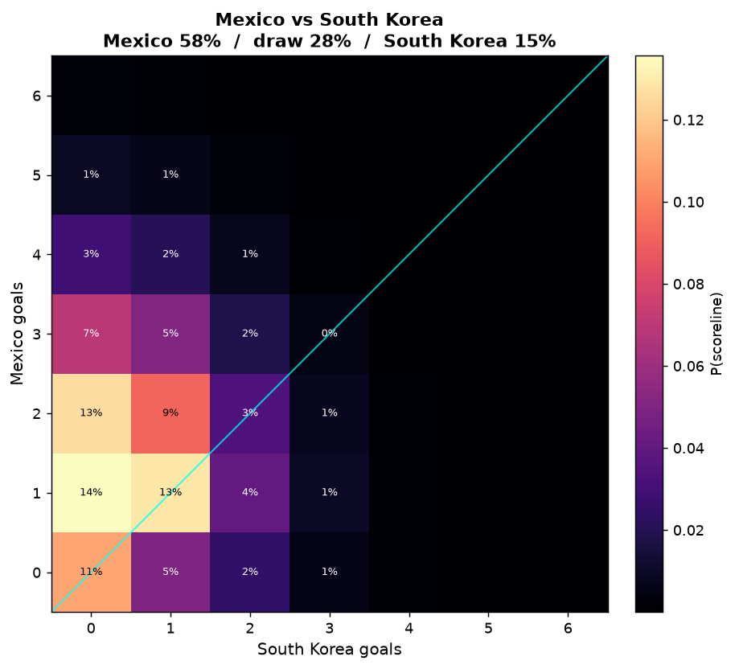
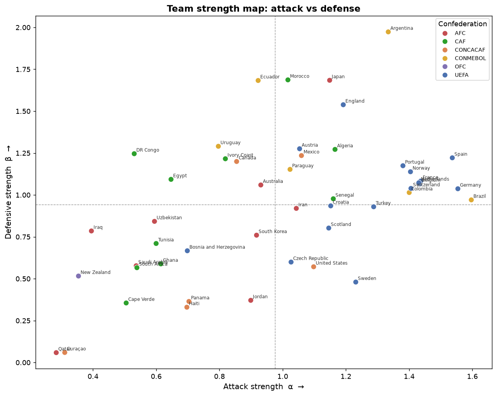

# FIFA World Cup 2026 Predictor

This is a statistical model for predicting individual matches and the overall winner of the FIFA World Cup 2026.

**How it works:** the model learns how good every national team is at scoring and defending from 32,000 historical matches (recent games count for more, and home teams get a boost), then turns that into the probability of every possible scoreline. A second layer adjusts those probabilities using squad market values and a self-calculated Elo rating. Finally, it plays the whole tournament 100,000 times following the official bracket rules and counts how often each team reaches each round.

On matches from 2022 onward, held out as a test set that no part of the model saw during training, it predicts outcomes about **21% better than random guessing**. Every modeling decision along the way is written up in the [Design Decisions](#design-decisions) section.

---

## Table of Contents

1. [Quick Overview](#quick-overview)
2. [Predictions](#predictions)
3. [Installation](#installation)
4. [How to Run](#how-to-run)
5. [Pipeline](#pipeline)
6. [Data Overview](#data-overview)
7. [Project Structure](#project-structure)
8. [Design Decisions](#design-decisions)
9. [Output Interpretation](#output-interpretation)
10. [Caveats](#caveats)
11. [References](#references)

---

## Quick Overview

| Component | What it does |
|---|---|
| **Dixon-Coles model** | Learns each team's attack and defense strength from past match history, and predicts the full scoreline distribution |
| **Context-dependent ρ** | Adjusts for game context: high-stakes games between equal teams end 0-0 or 1-1 more often |
| **LightGBM calibrator** | Second opinion based on squad market values and Elo |
| **Tournament simulation** | Plays the real bracket 100,000 times: groups, third-place rules, extra time, penalties |
| **Confidence intervals** | Every probability comes with a range |

---

## Predictions

*Figures below come from a sample pre-tournament run; the numbers shift as group-stage results come in and the data refreshes.*

**Who's favored to win**



The headline output. Each bar is a team's probability of lifting the trophy, counted over 100,000 simulated tournaments. With 48 teams in the field the title is wide open, so even the favorite sits well below 20% and the chasing pack stays tightly bunched.

**How every group shakes out**



Each row is a team, each column a finishing position, and the color is the probability of landing there. A sharp diagonal means a settled group; smeared color means a toss-up. The top two of each group advance (plus the best third-placed teams), so the two leftmost columns are the ones that decide who goes through.

**Inside a single match**



Produced by `--match A B`. Home goals run along one axis, away goals along the other, and each cell is colored by the probability of that exact scoreline. The brightest cells are the likeliest results, and the way the mass leans toward one corner shows which side is favored and by how much. This is the Dixon-Coles distribution itself, the thing the win/draw/loss numbers are summed up from.

**What the model learned**



Every team placed by its fitted attack strength (α) against its defense strength (β), colored by confederation. This isn't an input, it's the model's own picture of the world. The usual contenders landing in the strong-attack, strong-defense corner is the quickest sanity check that the ratings track reality, and the spread also exposes playing styles: some teams score freely but concede, others win low and tight.

---

## Installation

Requires Python 3.13+ (and `libomp` on macOS for LightGBM):

```bash
# macOS only
brew install libomp

git clone https://github.com/gabreyrom/wc2026_predictor.git
cd wc2026_predictor
python3 -m venv .venv
source .venv/bin/activate
pip install pandas numpy scipy scikit-learn lightgbm joblib tqdm matplotlib
```

---

## How to Run

```bash
source .venv/bin/activate
python main.py
```
The full pipeline takes 8 to 10 minutes. It downloads the necessary data on the first run, fits all models, simulates the tournament, and writes outputs to today's folder (`results/<today>/`).

### Useful options

| Argument | Default | Description |
|---|---|---|
| `--match TEAM1 TEAM2` | — | Deep dive on any matchup: probabilities, CIs, scorelines + saves its heatmap |
| `--load-calibrator` | off | Reuse the saved calibrator, saving ~5 minutes versus a full run (ideal for daily reruns) |
| `--plots` | off | Generates plots and saves them in the corresponding `results/<date>/figures/` |
| `--n-mc N` | 100,000 | Number of tournament simulations |
| `--skip-calibration` | off | Skip evaluation + LightGBM, raw model only |
| `--n-bootstrap N` | 500 | Samples behind each confidence interval |
| `--ignore-results` | off | Ignore played WC matches: pure pre-tournament predictions |
| `--force-download` | off | Re-download match data |
| `--seed N` | 42 | Reproducibility |

```bash
# Example run # 1
python main.py --skip-calibration --n-mc 10000

# Single match deep dive
python main.py --match "Mexico" "South Africa"
```
---

## Pipeline

```
Historical results (32k matches, 1990 → WC kickoff)   Transfermarkt squad values
        │                                            (204 teams × 5 era snapshots)
        ▼                                                      │
[1] Data cleaning & tournament categorization                  │
        ▼     (training capped at 2026-06-11 — WC matches       │
        │      enter only via conditioning, never training)     │
[2] Elo ratings (pre-match, anti-leakage → calibrator feature) │
        ▼                                                      │
[3] Dixon-Coles PRODUCTION fit (all 2010+ data)                │
        │     λ = exp(α_i − β_j + η·home),  context-dependent ρ│
        │                                                      │
        ├──[3.5] OUT-OF-FOLD CALIBRATION (rolling origin):     │
        │        model vintages fit <2016 / <2018 / <2020 each │
        │        predict their next 2 years out-of-sample      │
        │                                                      ▼
        └──[3.7] LightGBM calibrator (5-fold CV-tuned) ◄── log_value_ratio
                 trained on the OOF union; verdict from a fresh
                 test predictor (fit <2022, scored on 2022+)
        │
        ▼     ◄── played WC matches (data/wc2026_results.csv)
[4] Exact group enumeration (3^6 per group, calibrated outcome masses)
        │      played matches enter as fact (prob 1, real goals)
        ▼
[5] Monte Carlo (N=100k, ~35s) over the OFFICIAL FIFA bracket
        │     • calibrated score matrices (LGBM decides who wins,
        │       DC decides by how much)
        │     • played matches fixed; extra time at ⅓ rates, then 50/50 pens
        ▼
[6] Sanity checks (probabilities sum to 1, rounds monotone,
        exact-vs-MC agreement)
        ▼
Outputs: top-5 champions, tournament table, daily CSV snapshots, per-match CIs
```

**Why multiple Dixon-Coles fits?** The production model uses all data up to before the tournament start. But a model can't be graded on matches it's trained on. So separate models, each fitted only on the past relative to the matches they're scored on, produce the honest evaluation numbers and the calibrator's training data. The calibrator trains across three model vintages, making it robust to the shift between evaluation-time and production-time inputs.

---

## Data Overview

### Match history — `data/raw/results.csv`

About 49,000 international results (1872 to present) come from the canonical [martj42 dataset](https://github.com/martj42/international_results), updated within days of each match. They're filtered to 1990 onward and capped at the WC 2026 kickoff, which leaves 32,287 matches after cleaning (through 2026-06-10). Auto-downloaded on first run.

Two cleaning steps worth flagging:
- **Hard training cutoff at 2026-06-11.** The source pre-populates the WC fixtures and fills in scores as they're played, so the cutoff keeps every WC match out of training and the tournament can't leak into the model.
- **Tournament categorization.** Tournament types are grouped into categories that feed our own Elo computation.

### Squad market values — `data/market_values.json`

Total squad value (M€) for 204 national teams at five era snapshots (2013 / 2016 / 2019 / 2022 / 2025), scraped from Transfermarkt's historical season squad pages, so no future information leaks into training. Each match uses the latest snapshot at or before its date. Builder: `src/data/fetch_market_values.py`.

### Live tournament results — `data/wc2026_results.csv`

All 104 fixtures with official dates. Updated manually after each matchday: fill in scores and set `played=1`, and for knockout shootouts also set the `winner` flag. `--ignore-results` recovers pure pre-tournament predictions.

### WC 2026 draw — `tournament/wc2026_draw.py`

Official 12-group draw, host nations, and the 48-team list (`data/wc2026_teams.json`).

### Daily prediction snapshots — `results/YYYY-MM-DD/`

Each run writes that day's complete output set (same-day reruns overwrite in place):

- `tournament_probs.csv` — advancement probabilities per team
- `group_position_probs.csv` — per-group 1st/2nd/3rd/4th + expected pts/GD/GF
- `match_scorelines.csv` — top-5 most likely scorelines per group fixture
- `match_probabilities.csv` — all 104 matches with probabilities + 90% CIs
- `prob_match_scoring.csv` — P(each team scores 1+ goals) per group fixture
- `figures/` — visualizations (`--plots`)

---

## Project Structure

```
wc2026_predictor/
│
├── main.py                        # Full pipeline entry point
├── evaluate.py                    # Score predictions vs results → evaluations/*.md
│
├── tournament/
│   └── wc2026_draw.py             # Official groups A–L, hosts, aliases
│
├── src/
│   ├── data/
│   │   ├── fetch_matches.py       # Download & clean match history (+ WC cutoff)
│   │   ├── fetch_market_values.py # One-time Transfermarkt snapshot builder
│   │   ├── market_values.py       # Era-snapshot value lookup (no leakage)
│   │   ├── elo.py                 # Confederation-aware Elo + pre-match elo_diff
│   │   ├── confederations.py      # Team → confederation map (Elo K-factor splits)
│   │   ├── wc_results.py          # Loads played WC matches for conditioning
│   │   └── features.py           # Rolling form/momentum (tested, rejected — §7)
│   │
│   ├── model/
│   │   ├── dixon_coles.py         # Core model: MLE, home adv, Fisher info, bootstrap
│   │   ├── calibration.py         # Temporal evaluation, OOF folds, significance tests
│   │   └── lgbm_calibrator.py     # CV-tuned LightGBM calibration layer
│   │
│   ├── simulation/
│   │   ├── group_stage.py         # Exact enumeration + calibrated matrices
│   │   ├── monte_carlo.py         # MC over official bracket, MatchCache, extra time
│   │   └── bracket.py            # Legacy (not used by main.py)
│   │
│   └── output/
│       ├── results.py             # Tournament table + all CSV outputs
│       ├── match_report.py       # Per-match deep dive
│       └── visualize.py          # Tournament figures (--plots) + match heatmap
│
├── notebooks/
│   └── wc_eda.ipynb               # Loads the latest snapshot: scorelines + figures
│
├── data/                          # Inputs (market values, teams, live results)
├── results/                       # One folder per day of predictions
├── evaluations/                   # eval_<date>.md — predictions scored vs results
└── models/                        # Saved calibrator
```

---

## Design Decisions

### 1. Dixon-Coles bivariate Poisson

Plain Poisson models treat each team's goals as independent, but real football produces more 0-0 and 1-1 draws than independence predicts. Dixon and Coles (1997) fix exactly that with a correction factor on the four low-score outcomes:

```
P(X=x, Y=y) = τ(x, y, λ, μ, ρ) · Poisson(x; λ) · Poisson(y; μ)

τ(0,0) = 1 − ρλμ    τ(1,0) = 1 + ρμ
τ(0,1) = 1 + ρλ     τ(1,1) = 1 − ρ
```

Here λ and μ are the two teams' expected goals, and ρ only touches the low-scoring cells, nudging the draw outcomes up to match what actually happens.

### 2. Home advantage

Home teams win 50.7% of non-neutral matches against 25.7% for visitors (1.69 vs 1.01 goals), and 72% of the training data has a real home team. One fitted coefficient captures it:

```
log λ = α_i − β_j + η·home        fitted η = 0.247  →  ×1.28 goals at home
```

The WC 2026 hosts (USA, Mexico, Canada) get this boost. Adding η was the single biggest improvement to the model.

### 3. Context-dependent ρ

The size of that low-score correction shouldn't be fixed, it depends on the match. A tense knockout game between two equal teams plays out very differently from a friendly between mismatched sides, so ρ is allowed to vary:

```
ρ(match) = −0.99 / (1 + exp(−(γ₀ + γ₁·|Δα| + γ₂·importance)))
```

The sigmoid keeps ρ in a valid range by construction, and L2 regularization stops the coefficients from drifting into flat regions of the likelihood where the correction quietly dies. Fitted, ρ ≈ −0.16 for evenly matched teams and weaker as the gap widens.

### 4. Identifiability

Adding the same constant to every attack rating and every defense rating leaves the predictions unchanged, so the parameters aren't unique on their own (the model has one free direction). A soft sum-to-zero constraint (Σα = Σβ = 0) pins that direction down, which makes each team's parameters unique and the uncertainty math well-defined.

### 5. Training and validation: three layers, one rule

The whole setup exists to answer one obvious question: how good is this model on matches it has never seen? You can't just check it against its own training data, every model looks brilliant on games it has already seen. And the usual fix, shuffling matches into random train/test folds, breaks for time series: you'd predict a 2019 game with a model that trained on 2020. So the rule throughout is simple, training always comes before the matches it's judged on. That one rule produces three layers.

**Layer 1: fit the core model.** Dixon-Coles finds the attack/defense parameters that make the real scorelines most likely, with recent matches weighted more heavily (exp(−0.003 · days_ago), half-life ≈ 231 days) so current form dominates. Nothing to cross-validate here, it's a single fit. The fact to carry forward: a model fitted up to 2016 has never heard of the matches played after. The next layer turns that blind spot into useful data.

**Layer 2: the temporal "CV".** Several model vintages are fitted, each on a different slice of the past, and each only predicts the years that come after its training window:

```
timeline:  2010 ════════ 2016 ────── 2018 ────── 2020 ────── 2022 ────── 2026

Fold 1:    [══ train ══]→[predict ]
Fold 2:    [════ train ════════]──→[predict ]
Fold 3:    [══════ train ══════════════]───→[predict ]
TEST:      [════════ train ════════════════════]──→[ score ONCE ]
```

Every prediction here is "what the model would have said at the time, before seeing the result." Stacked together (~5,300 of them), they become the training data for the calibrator, which needs to learn the mistakes the core model makes on unseen matches (going stale, mis-rating draws, missing value shifts). Feed it in-sample predictions instead and there'd be no real mistakes left to correct.

**Layer 3: tune the calibrator with ordinary 5-fold CV.** The LightGBM's hyperparameters are picked by plain random-fold CV, but inside the out-of-sample rows from Layer 2, so the time-ordering was already protected one level up. CV landed on num_leaves=3, barely more than a straight line: the correction is genuinely simple, and bigger trees just memorized noise.

**The final scorecard.** Only now is the test set (2022+) opened, and only once. A model fitted on pre-2022 data predicts it, the calibrator corrects, and a paired bootstrap on per-match log-losses gives the verdict:

| Model | Test log-loss | vs. uniform baseline (1.0986) |
|---|---|---|
| Dixon-Coles (+ home advantage) | 0.9261 | +15.7% |
| **DC + LightGBM (+ values & Elo)** | **0.8711** | **+20.7%** |

The gap is **statistically significant** (calibrator vs raw DC: Δ = −0.055, 95% CI [−0.067, −0.044], p ≈ 0). Every other idea documented in this README faced this exact test; the ones that didn't beat it were dropped (§7). The model that actually predicts the tournament is then refitted on all data up to the eve of kickoff. The validation machinery exists only to tell us how far to trust it.

*(Test set = international matches from 2022 onward, n = 4,552, none seen during fitting. The ~20% headline is stable across data refreshes.)*

**In one line**: the core model is fitted, the calibrator is cross-validated only inside predictions that were already out-of-sample, and the test set is a vault opened once.

### 6. The LightGBM calibrator: market values and Elo

After Dixon-Coles makes its prediction, a small second model (a CV-tuned LightGBM) takes a second look. It reads the DC win/draw/loss probabilities plus a couple of outside signals and nudges them. Its two most useful inputs both measure team strength in ways the core model picks up too slowly:

- **`log(value_i / value_j)`** — squad market value ratio (Transfermarkt). Catches slow change: a golden generation shows up in player valuations long before it shows up in results.
- **`elo_diff`** — pre-match Elo difference, catches *fast* change: Elo jumps the moment a big result lands, while the core model's time-weighted strengths only drift toward it over many matches. The K-factors are confederation-aware: a World Cup game counts more than a friendly, a UEFA qualifier more than a minor-confederation one (`match_k_factor` in `elo.py`).

**Why add this if the core model already knows team strength?**  Because strength learned from past scores goes out of date, and it does so at two different speeds. Market values fix the slow drift, Elo fixes the fast drift. That's the calibrator's whole job. It's also why these signals live here and not inside Dixon-Coles itself: we tried that, and the attack/defense parameters just swallowed them with nothing left to show (§7). Each feature had to beat a paired-bootstrap test on unseen matches before it earned its place.

Training the calibrator across three model vintages (Layer 2 above) keeps it robust when it's handed the production model's slightly different outputs at the end.

**How the Elo is computed.** In a single chronological pass over the full match history, each game nudges both teams' ratings by `K · (result − expected)`, where the expected result comes from the rating gap and is scaled up for bigger goal differences. Ratings are always read *before* a match, so a game never feeds its own feature. The weight `K` reflects what's at stake, using our custom, confederation-aware ladder:

| K | Competition |
|---|---|
| 100 | FIFA World Cup, UEFA Euro |
| 90 | Copa América |
| 80 | UEFA World Cup qualifying |
| 70 | UEFA Nations League, CONMEBOL World Cup qualifying, Confederations Cup |
| 60 | Africa Cup of Nations, AFC Asian Cup, Gold Cup |
| 50 | Other World Cup qualifying, CONCACAF Nations League |
| 40 | Continental qualifiers, friendlies |
| 30 | Minor / regional tournaments |

### 7. What we tried that didn't make the cut

Knowing what doesn't help shaped the model as much as what does. Each was tested the same way as everything else, and dropped because it didn't significantly improve the held-out loss, and in a couple of cases made it worse.

| Idea | Why it didn't make it |
|---|---|
| Market values inside the core model | Team-strength parameters absorbed them; values only help out-of-sample, so they moved to the calibrator (§6) |
| Recent form (points per game) | Made predictions *worse*: easy wins over weak teams masquerade as form |
| Opponent-adjusted momentum | Once strength is accounted for, "momentum" is mostly luck, and luck doesn't persist |
| Draw-rate / form features in the calibrator | No measurable gain: dropped to keep the model simple |
| Squad age difference | No signal anywhere; *average* age doesn't capture key-player dependence |
| Confederation matchup effects | Elo and market values (both confederation-neutral) already cover it; adding it only fit noise |
| Squad value *trend* between snapshots | Zero effect: current value and Elo already reflect the rise; the path there adds nothing |
| Star concentration (top players' share of value) | Zero effect: elite squads look nearly identical here; what matters is who's actually *available*, which needs lineup data |

The code for all of these is still in the repo and tested; main.py just doesn't feed them in.

### 8. Calibrated simulation

The simulation doesn't run on the raw Dixon-Coles probabilities. Instead it uses score matrices that have been rescaled so the win/draw/loss totals match the calibrator:

```
M'[i,j] = M[i,j] · p_cal(outcome of (i,j)) / p_DC(outcome of (i,j))
```

The LightGBM decides *who wins*, and Dixon-Coles decides *by how much*. That keeps the tournament table and the per-match probabilities telling the same story, with the best-validated model driving both.

### 9. Official FIFA 2026 bracket

All 16 Round-of-32 matches are hard-coded from the official schedule and wired so winners flow through the real R16 → QF → SF → Final tree. Third-place allocation is officially a 495-row lookup table; here it's implemented as the rule that generates that table (a constrained matching) and verified against all 495 combinations. Bracket position carries real signal: a group winner that lands in a stacked quarter pays for it in title probability.

### 10. Extra time and penalties

Knockout draws go to 30 minutes of extra time, modeled at one-third of normal scoring rates so the stronger team still gets its real edge, before a 50/50 shootout. The literature finds penalty shootouts are essentially coin flips.

### 11. Confidence intervals

The optimizer's built-in curvature estimate is a low-rank approximation, and it produced nonsense intervals (Brazil came out at [1%, 99%]). Instead, the observed Fisher information is computed analytically from the Poisson structure, which gives each matchup's parameters their exact marginal covariance. The result is intervals that are tight for teams with rich data and honestly wide for thin-history teams like Curaçao or Jordan, where the model really does know little.

### 12. Performance

A few optimizations make the full run practical:

| Optimization | Effect |
|---|---|
| 3-outcome group enumeration (vs full scorelines) | hours → 0.3s for all 12 groups |
| Vectorized score matrices | ~100× faster per call |
| Precomputed per-pair distributions (`MatchCache`) | 100k simulations: 8h → ~35s |

---

## Output Interpretation

Every run writes its CSVs to `results/<date>/`. All probabilities are stored as decimals between 0 and 1 (multiply by 100 for a percentage). The samples below are rounded for readability.

### `tournament_probs.csv` — who advances and who wins

One row per team. Each round column is the probability the team reaches at least that round, so the numbers shrink as the rounds get harder. `Winner` is the title probability, and `top2` is the chance of finishing in the top two of the group.

- `team` — national team
- `Group` — group letter (A–L)
- `R32`, `R16`, `QF`, `SF`, `Final` — P(reach at least this round)
- `Winner` — P(win the tournament)
- `top2` — P(finish 1st or 2nd in the group)

```
team,Group,R32,R16,QF,SF,Final,Winner,top2
Argentina,A,0.999,0.776,0.630,0.469,0.287,0.182,0.991
Spain,B,0.978,0.681,0.498,0.382,0.257,0.157,0.930
England,F,0.999,0.759,0.516,0.303,0.179,0.103,0.995
France,D,0.995,0.707,0.421,0.260,0.148,0.079,0.962
```

A round column doesn't sum to 100% down the teams: 16 teams reach the R16, so that column adds up to about 16.

### `group_position_probs.csv` — final group standings

Four rows per group, one per team. The `p_1st`…`p_4th` values are the probability of finishing in each position and sum to 1 for each team. The `exp_*` columns summarize the same simulations as plain averages.

- `group`, `team`
- `p_1st`, `p_2nd`, `p_3rd`, `p_4th` — P(finish in that position)
- `exp_pts` — expected group points
- `exp_gd` — expected goal difference
- `exp_gf` — expected goals scored

```
group,team,p_1st,p_2nd,p_3rd,p_4th,exp_pts,exp_gd,exp_gf
A,Mexico,0.697,0.208,0.094,0.001,6.71,3.56,5.33
A,South Korea,0.287,0.536,0.170,0.006,6.11,1.30,4.50
A,Czech Republic,0.013,0.195,0.550,0.242,2.70,-1.20,3.54
A,South Africa,0.003,0.061,0.186,0.750,1.50,-3.66,1.61
```

### `match_probabilities.csv` — per-match win/draw/loss

The widest file. It carries the raw Dixon-Coles probabilities, their 90% confidence intervals, and the calibrated probabilities side by side. The `cal_*` columns are the ones to quote; the rest show the model's uncertainty and how far the calibrator moved the raw numbers.

- `stage` — `group`, `R32`, `R16`, `QF`, `SF`, `3rd-place`, or `Final`
- `match_no` — knockout slot number (blank for group rows)
- `group` — group letter (blank for knockout rows)
- `home_team`, `away_team`
- `p_pairing` — how often this exact pairing came up in the simulation
- `p_home`, `p_draw`, `p_away` — raw Dixon-Coles probabilities
- `ci_*_lo`, `ci_*_hi` — 90% confidence interval for each outcome
- `cal_home`, `cal_draw`, `cal_away` — calibrated probabilities

Group rows are simple: one per fixture, `p_pairing = 1`, with the group filled in. Knockout rows work differently. The bracket isn't drawn yet, so each slot lists its three most likely pairings, and the outcome probabilities on those rows are conditional on that pairing actually happening. Don't multiply `p_pairing` into the outcome columns expecting a clean marginal, since the two answer different questions.

Sample trimmed to stage, teams, pairing, and the calibrated columns (the raw `p_*` and `ci_*` columns are omitted here for width):

```
stage,match_no,group,home_team,away_team,p_pairing,cal_home,cal_draw,cal_away
group,,A,Mexico,South Korea,1.00,0.521,0.254,0.226
R32,73,,South Korea,Canada,0.185,0.315,0.293,0.392
R32,73,,South Korea,Switzerland,0.161,0.236,0.268,0.496
```

### `match_scorelines.csv` — most likely exact scores

Group fixtures only, since knockout pairings aren't known in advance. Each fixture gets five rows: its five most likely exact scorelines, ranked by probability. The `p_home`/`p_draw`/`p_away` columns repeat the fixture's overall result probabilities on every row for context.

- `stage`, `group`, `home_team`, `away_team`
- `p_home`, `p_draw`, `p_away` — overall outcome probabilities for the fixture
- `rank` — 1 to 5, most to least likely
- `score` — exact scoreline as `home-away`
- `prob` — P(that exact scoreline)

```
stage,group,home_team,away_team,p_home,p_draw,p_away,rank,score,prob
group,A,Mexico,South Korea,0.578,0.277,0.145,1,1-0,0.136
group,A,Mexico,South Korea,0.578,0.277,0.145,2,1-1,0.129
group,A,Mexico,South Korea,0.578,0.277,0.145,3,2-0,0.126
group,A,Mexico,South Korea,0.578,0.277,0.145,4,0-0,0.110
group,A,Mexico,South Korea,0.578,0.277,0.145,5,2-1,0.092
```

### `prob_match_scoring.csv` — chance each team scores

One row per group fixture. `prob_home` is the probability the home team scores at least one goal, and `prob_away` is the same for the away team.

- `home_team`, `prob_home` — P(home team scores 1+)
- `away_team`, `prob_away` — P(away team scores 1+)

```
home_team,prob_home,away_team,prob_away
Mexico,0.808,South Korea,0.517
Mexico,0.865,South Africa,0.393
Mexico,0.856,Czech Republic,0.556
```

### Match report (`--match A B`)

Not a file, but the most readable view of a single matchup. Quote the calibrated probabilities as your point estimate, use the CI to express confidence, and read the scorelines for how the match itself plays out.

### Figures (`--plots`)

`python main.py --plots` renders the tournament figures into `results/<date>/figures/`. Three are featured in [Predictions](#predictions) above (`title_race`, `group_heatmap`, `attack_defense`); the rest:

| Figure | What it shows |
|---|---|
| `bracket` | Modal knockout bracket: the most likely team in each slot, with the paths drawn through |
| `strength_vs_value` | Model P(win) against squad market value: which teams the model rates above or below their price tag |
| `calibration_curve` | Reliability diagram (raw DC vs calibrated vs a perfect model), the honesty check |
| `evolution_title_race` | P(win) over time, one line per favorite: the title race as it shifts day to day |
| `evolution_bubble` | P(reach R16) over time for the biggest movers: the group-stage drama |

The two `evolution_*` charts read every daily snapshot, so they appear once at least two days of predictions exist and gain detail with each matchday. A further figure, the per-match scoreline heatmap, is produced on demand by `--match A B` and saved as `match_<A>_vs_<B>.png` (the sample shown in Predictions is one of these). It isn't generated on a plain `--plots` run.

To browse a run, [`notebooks/wc_eda.ipynb`](notebooks/wc_eda.ipynb) auto-loads the most recent snapshot and shows the scorelines table together with every figure for that day, one per cell. Re-run it after each `main.py` run (needs Jupyter: `pip install jupyterlab`).

### Scoring against results (`evaluate.py`)

Once matches are played, `python evaluate.py [date]` grades a snapshot's predictions against the real outcomes in `data/wc2026_results.csv` (aligning home/away orientation automatically) and writes a markdown report to `evaluations/eval_<date>.md`. With no date it scores the earliest, pre-tournament snapshot. It produces two scorecards.

**Match-level** (live as soon as any matches are played): the exact-scoreline hit rate (how often the single most likely score was right), the top-5 scoreline hit rate, outcome accuracy for both the raw and calibrated models, mean log-loss and Brier score against the coin-flip baseline (1.099), and a win/draw/loss confusion matrix. Trust the log-loss over raw accuracy here: a draw is rarely the model's single top pick, so in a draw-heavy run the accuracy understates how well it actually called the winners.

**Tournament-level** (activates automatically once all 72 group matches are entered): scores the pre-tournament `P(reach R32)` against who actually qualified: how many of the real 32 the model had in its top 32, the qualification Brier and log-loss, and the biggest surprises in both directions.

---

## Caveats

Every model trades some realism for tractability. Here's what this one assumes, and where it falls short.

### Assumptions

- **The calibrator changes who wins, not the scoreline.** When market values say a team is better than its results suggest, the simulation makes it win more often, but its winning scorelines keep their original shape (it won't start winning 4-0 instead of 2-0). This only matters for goal-difference tiebreakers.
- **Group-table tiebreakers use a shortcut.** The "exact" group tables break ties on expected goals rather than every possible scoreline, and skip head-to-head. The measured cost is up to about 6pp on a team's top-2 probability. The Monte Carlo handles tiebreakers properly and drives every headline number; the shortcut only feeds the display tables.
- **Parameters are frozen during the tournament.** Played matches update the simulation through conditioning, but the α/β strengths stay at the pre-tournament fit. A handful of matches barely moves them, and freezing keeps the daily snapshots comparable.
- **Penalties are a coin flip.** Extra time is modeled at reduced scoring rates, but the shootout is a 50/50, which the literature supports.
- **Third-place assignment picks one valid option.** Where FIFA's table might choose another arrangement among equals, the model picks one, and who-can-meet-whom is always respected.
- **Pre-2013 matches reuse the 2013 value snapshot.** No older Transfermarkt data exists, but the calibrator only trains on predictions from 2016 onward, so these fall outside its window entirely.

### Main constraints

- **No squad or injury data.** "Brazil" is a single fixed entity no matter who actually takes the field.
- **The confidence intervals don't cover everything.** They measure how uncertain the team strengths are, not whether the Poisson model itself is right. No interval can capture "the assumption is off," so read them as rough 90% ranges, not a guarantee.
- **Draws are rarely the top pick.** Draw probabilities come out well-calibrated, but a draw is seldom the single most likely result, so the model under-calls them as outright predictions.
- **Debutants have thin histories.** Teams like Curaçao, Jordan, and Haiti have little data, so their intervals are wide. That's reported as-is rather than hidden.
- **Host advantage applies throughout.** The USA, Mexico, and Canada keep the home boost even in late rounds at venues that may not favor them.

---

## References

- **Dixon, M. J. & Coles, S. G. (1997).** *Modelling Association Football Scores and Inefficiencies in the Football Betting Market.* Journal of the Royal Statistical Society, Series C, 46(2), 265–280.

- **Karlis, D. & Ntzoufras, I. (2003).** *Analysis of sports data by using bivariate Poisson models.* Journal of the Royal Statistical Society, Series D, 52(3), 381–393.

- **Towards Data Science (2022).** *Can Machine Learning Predict the World Cup?* Practical reference for the temporal-validation and calibration-layer architecture.
  [https://towardsdatascience.com/can-machine-learning-predict-the-world-cup/](https://towardsdatascience.com/can-machine-learning-predict-the-world-cup/)
  GitHub: [marco-hening-tallarico/International-Football-Match-Forecasting-Pipeline](https://github.com/marco-hening-tallarico/International-Football-Match-Forecasting-Pipeline)

- **Wikipedia.** *2026 FIFA World Cup knockout stage.* Official R32 match definitions, third-place slot constraints, and bracket flow.
  [https://en.wikipedia.org/wiki/2026_FIFA_World_Cup_knockout_stage](https://en.wikipedia.org/wiki/2026_FIFA_World_Cup_knockout_stage)

- **martj42.** *International football results from 1872 to present.* Canonical match history dataset, updated within days of each match.
  [https://github.com/martj42/international_results](https://github.com/martj42/international_results)

- **Transfermarkt.** Squad market values (era snapshots from historical season squad pages).
  [https://www.transfermarkt.com](https://www.transfermarkt.com)

## Author

**Gabriel Reynoso** — Data Scientist
[LinkedIn](https://www.linkedin.com/in/gabrielreynosorom) · [GitHub](https://github.com/gabreyrom)

Questions, ideas, or spotted a bug? Open an issue or reach out.